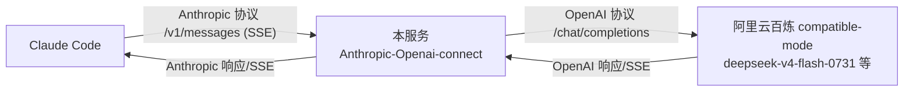

# Anthropic-Openai-connect

将 **Claude Code 的 Anthropic Messages 协议** 请求转换为 **OpenAI Chat Completions 协议** 并转发到 OpenAI 兼容端点（阿里云百炼 compatible-mode、DeepSeek 兼容端点等）的本地代理服务。

解决的核心问题：Claude Code 只讲 Anthropic 协议（`POST /v1/messages`），而阿里云百炼等国内平台普遍只提供 OpenAI 兼容端点（`POST /v1/chat/completions`）——协议对不上导致 Claude Code 无法直连。本服务在中间做协议翻译。

## 特性

- ✅ Anthropic Messages → OpenAI Chat Completions 双向转换
- ✅ 支持流式（SSE）与非流式两种响应，SSE 事件序列完整（`message_start` → `content_block_*` → `message_delta` → `message_stop`）
- ✅ 支持工具调用（function calling）：Anthropic `tool_use`/`tool_result` ↔ OpenAI `tool_calls`/`tool` 消息
- ✅ 模型名映射表：Claude Code 里配置的模型名可自由映射到上游模型 ID
- ✅ 可选本地鉴权 Token、`/v1/models`、`/v1/messages/count_tokens` 辅助端点
- ✅ 零框架依赖之外仅需 `express` + `dotenv`，Node 18+ 内置 fetch

## 工作原理



| 协议项 | Anthropic（入站） | OpenAI（出站） |
|---|---|---|
| 端点 | `POST /v1/messages` | `POST /chat/completions` |
| 系统提示 | `system` 字段 | `messages[0].role=system` |
| 内容块 | `{type:text/tool_use/tool_result}` | `content` 字符串 / `tool_calls` / `role=tool` |
| 工具 | `tools[].input_schema` | `tools[].function.parameters` |
| 思考模式 | `thinking.type=enabled` | `enable_thinking=true`（百炼） |
| 结束原因 | `stop_reason` | `finish_reason` |

## 快速开始

要求：Node.js ≥ 18

```powershell
# 1. 进入项目目录
cd E:\agent-project\Anthropic-Openai-connect

# 2. 安装依赖
npm install

# 3. 配置上游（把 .env.example 复制为 .env 并填入你的百炼 Key）
Copy-Item .env.example .env
#   编辑 .env：
#   UPSTREAM_API_KEY=sk-你的百炼Key      （必填）
#   DEFAULT_MODEL=deepseek-v4-flash-0731
#   LOCAL_AUTH_TOKEN=local-dev-token     （强烈建议设置，见下方「安全」）

# 4. 启动
npm start
```

启动成功输出：

```
│  Anthropic-Openai-connect 已启动                      │
│  监听:    http://127.0.0.1:18880                    │
│  上游:    https://dashscope.aliyuncs.com/compatible-mode/v1
```

## 配置 Claude Code

编辑 `C:\Users\13238\.claude\settings.json`（示例值，模型名请按你的上游调整）：

```json
{
  "env": {
    "ANTHROPIC_AUTH_TOKEN": "local-dev-token",
    "ANTHROPIC_BASE_URL": "http://127.0.0.1:18880",
    "ANTHROPIC_DEFAULT_HAIKU_MODEL": "deepseek-v4-flash-0731",
    "ANTHROPIC_DEFAULT_OPUS_MODEL": "deepseek-v4-pro",
    "ANTHROPIC_DEFAULT_SONNET_MODEL": "deepseek-v4-flash-0731",
    "ANTHROPIC_MODEL": "deepseek-v4-flash-0731",
    "CLAUDE_CODE_DISABLE_UNKNOWN_MODEL_WINDOW_ENFORCEMENT": "1",
    "CLAUDE_CODE_MAX_CONTEXT_TOKENS": "1000000"
  }
}
```

说明：
- `ANTHROPIC_AUTH_TOKEN` 必须与 `.env` 里的 `LOCAL_AUTH_TOKEN` 一致（本服务会校验该值，不匹配返回 401）
- 模型名会原样传到本服务，再由映射表决定是否替换；不配映射表则透传，上游不认的模型名会报错

## 环境变量

| 变量 | 默认值 | 说明 |
|---|---|---|
| `PORT` | `18880` | 本服务监听端口 |
| `HOST` | `127.0.0.1` | 监听地址。保持默认仅本机可访问；除非配置了鉴权，否则**不要**改成 `0.0.0.0` |
| `UPSTREAM_BASE_URL` | `https://dashscope.aliyuncs.com/compatible-mode/v1` | 上游 OpenAI 兼容端点 |
| `UPSTREAM_API_KEY` | 空 | 上游 API Key（必填） |
| `DEFAULT_MODEL` | `deepseek-v4-flash-0731` | 默认模型 |
| `MODEL_MAP` | 空 | 模型映射，格式 `claude-sonnet=deepseek-v4-flash-0731,claude-opus=deepseek-v4-pro` |
| `LOCAL_AUTH_TOKEN` | 空 | 本地鉴权 Token，强烈建议设置；留空则本服务不校验 |

## 验证

启动服务后（需 `.env` 已配好 Key）：

```powershell
# 健康检查（鉴权不校验 /health）
Invoke-RestMethod http://127.0.0.1:18880/health

# 非流式调用（模拟 Claude Code，需带 LOCAL_AUTH_TOKEN）
$body = @{
  model = "deepseek-v4-flash-0731"
  max_tokens = 64
  messages = @(@{ role = "user"; content = "你好，用一句话自我介绍" })
} | ConvertTo-Json -Depth 5
Invoke-RestMethod -Uri http://127.0.0.1:18880/v1/messages -Method Post `
  -Headers @{ "x-api-key" = "local-dev-token" } `
  -ContentType "application/json" -Body $body | ConvertTo-Json -Depth 6
```

## 安全

本服务会代理你的上游 API Key 调用，使用前请确认以下几点：

- **默认仅监听 `127.0.0.1`**：服务只对本机可见，局域网/公网不可达。不要把 `HOST` 改成 `0.0.0.0`——那会让任何能访问你端口的人借用你的 Key。
- **务必设置 `LOCAL_AUTH_TOKEN`**：这是服务自己的访问口令。未设置时任何本机进程都能用你的 Key 调用上游。设置后无口令/口令错误的请求直接返回 401。Claude Code 侧的 `ANTHROPIC_AUTH_TOKEN` 必须与之保持一致。
- **`.env` 含真实 Key，已被 `.gitignore` 排除**：永远不要提交、分享 `.env` 或其中的 Key；推送前可 `git status` 确认。
- **调用方权限**：模型能读写你的文件，Claude Code 的 `permissions` 是最后一道闸。建议在 `settings.json` 中 deny 敏感路径（如 `Edit(**/.env)`），并按需收紧 `allow` 列表。
- 上游为云服务（如阿里云百炼），你的对话内容会发送到该平台，属于正常使用范畴；但不要在本服务或 Claude Code 中粘贴未脱敏的敏感凭据。

## 目录结构

```
Anthropic-Openai-connect/
├── server.js            # 服务入口：Express 路由 + 转发
├── src/
│   ├── config.js        # 配置中心（.env 读取）
│   ├── converter.js     # 协议转换核心（双向 + SSE 流）
│   └── upstream.js      # 上游转发封装
├── .env.example         # 环境变量模板（复制为 .env 使用）
├── .gitignore
├── package.json
└── README.md
```

## 已知限制

- 未实现 Anthropic `thinking` 增量流（`thinking_delta`）输出，思考模式会以 `enable_thinking` 透传给上游，思考内容不单独回流为 `thinking` 块
- `/v1/messages/count_tokens` 为字符估算，非精确 tokenizer
- 上游需为 OpenAI Chat Completions 兼容格式

## License

MIT
